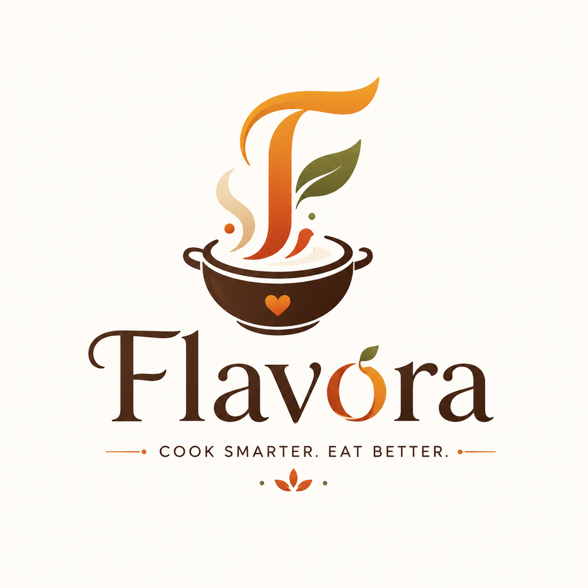

# 👨‍🍳 Flavora (Rasoi AI)



**Flavora (Rasoi AI)** is a next-generation AI-powered premium kitchen assistant built to revolutionize your cooking experience. By leveraging the power of Google's Gemini AI and dynamic image generation, Flavora provides authentic, culturally rich, and incredibly accurate recipes based on what you crave or what ingredients you have in your fridge.
## 🎯 Why We Built This

Have you ever looked into your fridge, seen a random assortment of ingredients, and thought, *"What on earth can I make with this?"* Or maybe you were craving a specific traditional dish but didn't want to sift through ad-heavy food blogs with endless life stories just to find the actual recipe.

We built **Flavora** to solve these exact problems. Cooking should be an art, not a chore. We wanted to create an ad-free, hyper-personalized, culturally authentic AI chef that brings the magic back into the kitchen. Whether you are trying to prevent food waste (Pantry Mode) or trying to recreate your grandmother's authentic Dal Makhani (Dish Mode), Flavora is your personal Master Chef.

## 📖 How to Use

1. **Sign up / Login:** Create a quick account so Flavora can remember your dietary preferences and save your favorite recipes.
2. **Choose Your Mode:** 
   - **By Ingredients:** Type in whatever you have in your fridge (e.g., "tomatoes, eggs, onions, old bread").
   - **By Dish Name:** Type exactly what you are craving (e.g., "Authentic Paneer Tikka Masala").
3. **Set Preferences:** Select how much time you have, your cooking skill level, and your dietary restrictions.
4. **Generate & Cook:** Hit generate! In seconds, you'll receive a stunning AI photo of your dish, precise measurements, and step-by-step instructions woven with warm, cultural terminology.
5. **Save:** Don't lose your masterpiece. Click the "Save to Favorites" button to add it to your personal digital cookbook.

## ✨ Features

- **🧠 AI Recipe Generator:** Tell the AI what you want to eat (e.g., "Authentic Butter Chicken"), and it will generate a complete, traditional recipe with precise measurements and steps.
- **📸 Dynamic AI Plating:** Every generated recipe instantly fetches a stunning, high-quality, cinematic AI-generated photo of the exact dish using Pollinations AI.
- **🧅 Smart Ingredient Scanner (Pantry Mode):** Input whatever leftovers you have in your fridge, and the AI will figure out the most delicious meal you can make with them to prevent food waste.
- **🔥 Firebase Authentication:** Secure, seamless email & password login with route protection.
- **🔖 Saved Recipes Collection:** Loved a recipe? Save it directly to your digital cookbook (Firestore database) and access it anytime in your dashboard.
- **🌊 Beautiful UI/UX:** Built with Tailwind CSS, Glassmorphism design principles, Framer Motion page transitions, and an interactive 3D WebGL background using Three.js.

## 🛠️ Tech Stack

- **Framework:** [Next.js 16](https://nextjs.org/) (App Router)
- **Styling:** [Tailwind CSS](https://tailwindcss.com/)
- **Animations:** [Framer Motion](https://www.framer.com/motion/) & [React Three Fiber](https://docs.pmnd.rs/react-three-fiber/)
- **Backend/DB:** [Firebase](https://firebase.google.com/) (Authentication & Firestore)
- **AI Models:** Google [Gemini API](https://ai.google.dev/) (Text) & [Pollinations AI](https://pollinations.ai/) (Images)

## 🚀 Getting Started Locally

### 1. Clone the repository
```bash
git clone https://github.com/YOUR_USERNAME/flavora-ai.git
cd flavora-ai
```

### 2. Install Dependencies
```bash
npm install
```

### 3. Setup Environment Variables
Create a `.env.local` file in the root directory and add your keys:
```env
NEXT_PUBLIC_FIREBASE_API_KEY="your-api-key"
NEXT_PUBLIC_FIREBASE_AUTH_DOMAIN="your-auth-domain"
NEXT_PUBLIC_FIREBASE_PROJECT_ID="your-project-id"
NEXT_PUBLIC_FIREBASE_STORAGE_BUCKET="your-storage-bucket"
NEXT_PUBLIC_FIREBASE_MESSAGING_SENDER_ID="your-sender-id"
NEXT_PUBLIC_FIREBASE_APP_ID="your-app-id"
GEMINI_API_KEY="your-gemini-key"
```

### 4. Run the Development Server
```bash
npm run dev
```
Open [http://localhost:3000](http://localhost:3000) with your browser to see the result.

## 🌍 Deployment (Firebase Hosting)

Since Flavora already uses Firebase for Authentication and Firestore, the easiest way to deploy this Next.js app is using **Firebase Hosting**, which fully supports Next.js.

1. **Install Firebase CLI:**
   ```bash
   npm install -g firebase-tools
   ```
2. **Login to Firebase:**
   ```bash
   firebase login
   ```
3. **Initialize Firebase in your project:**
   ```bash
   firebase init hosting
   ```
   *Select your existing Flavora project. When asked if you want to use a web framework, select **Yes** (it will auto-detect Next.js).*
4. **Deploy:**
   ```bash
   firebase deploy --only hosting
   ```

---

*Built with ❤️ and AI.*
